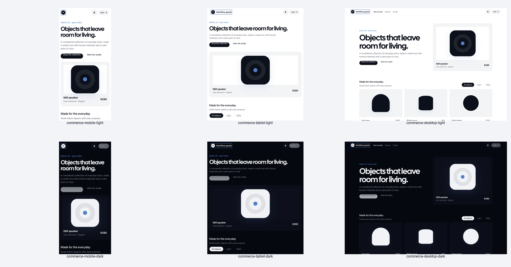
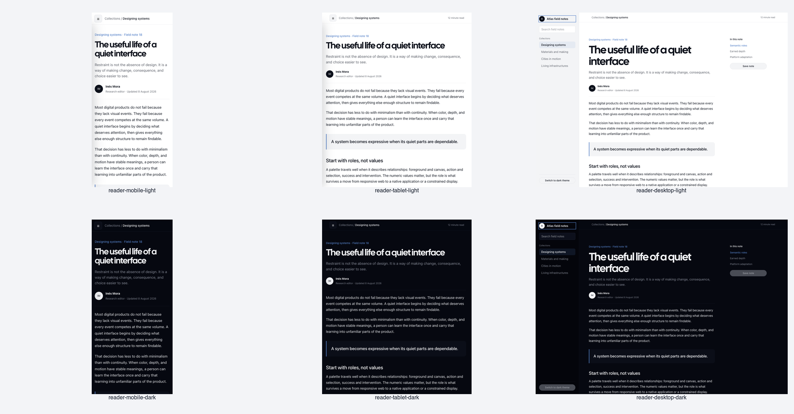
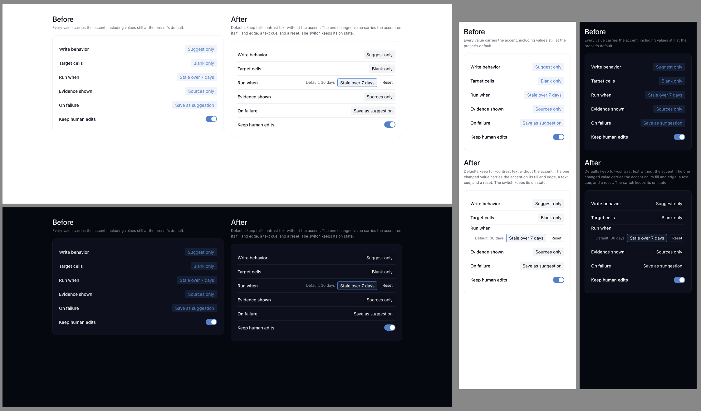

# Dogfood receipt

Date: 2026-08-09

## Plan

- **Stack:** Static web harnesses served over local HTTP. The skill repository has no deployable application stack.
- **Entry surfaces:** `/commerce/index.html` and `/reader/index.html`, independently materialized from the `foundation` profile.
- **Driver:** Interceptor in the user's real Chrome profile for navigation, state changes, accessibility-tree reads, and network inspection; Playwright for exact viewport screenshots and deterministic browser metrics.
- **Evidence:** The portability contact sheets and earlier agentic-extension evidence in [`dogfood/`](dogfood/).
- **Smoke:** Materialize and verify each target, require HTTP success for all explicit resources, and reject console errors, failed requests, horizontal overflow, unnamed buttons, or missing focus treatment.
- **End-to-end:** Change themes; filter merchandise and add an item to cart; change a reading collection, save a note, and exercise an empty search result.
- **Receipt anchor:** This file and the `broomva/skills` pull request.

## Portability test designs

### Commerce collection

A `foundation`-profile storefront for small-batch home objects. It uses a merchandising hero, product filters, prices, a cart action, product cards, and transaction feedback without any agentic-work vocabulary, work states, receipts, or orchestration shell.

### Editorial reader

A `foundation`-profile knowledge publication with collection navigation, search, sustained reading measure, article tools, a save action, and responsive mobile navigation. It uses the same visual identity through a structurally different content product.

## Portability receipt

| Plan row | Executed | Evidence |
|---|---|---|
| Materialization | Yes | Each finalized `foundation` target wrote and verified 8 files, including machine-readable semantic tokens. Neither target received work components, agentic motion, or the Maestro app. |
| Smoke | Yes | All 12 surface × viewport × theme cases loaded with no console errors, failed requests, or HTTP responses at 400 or above. |
| Visual themes | Yes | Twelve screenshots cover both non-agentic products at 375px, 768px, and 1440px in light and dark themes. |
| Responsive layout | Yes | Every case reported zero horizontal overflow. Commerce recomposed from a two-column hero and three-product grid; the reader moved its collection sidebar into mobile navigation. |
| Keyboard focus | Yes | The first keyboard-reachable control showed a solid `2px` focus outline in every case. No button lacked an accessible name. |
| Reduced motion | Yes | Harness transitions and animations computed to `0.01ms` under `prefers-reduced-motion: reduce`. |
| Commerce flow | Yes | In real Chrome, Interceptor changed to dark theme, selected the `Light` filter, reduced the accessible product set to one, added the Arc lamp, and observed `Cart · 1`. |
| Reader flow | Yes | In real Chrome, Interceptor changed to dark theme, saved the note (`pressed=true`), changed the active collection to `Materials and making`, searched for `missing`, and observed the empty-result status. |
| API or persistent side effect | Not applicable | These are static design harnesses; cart and saved-note state are intentionally session-local. |

## Visual conformity

- Both products preserve the blue-axis light/dark relationship, system application typography, scarce Resonant AI Blue, 4px rhythm, restrained radii, and matte working surfaces.
- The commerce surface expresses products, price, filters, cart state, and merchandising hierarchy rather than work orchestration.
- The reader expresses collections, article hierarchy, reading rhythm, search, and save state without becoming a card dashboard.
- Cal Sans appears only as an opt-in display face. Body, navigation, controls, metadata, and prices remain on the system or mono stacks assigned by role.
- Glass is limited to the transient commerce toast and sticky translucent chrome; ordinary cards, product surfaces, article content, and navigation remain matte.
- Functional and interactive state remains labeled structurally; no meaning relies on color alone.

## Agentic extension regression evidence

The earlier work-console and decision-receipt contact sheets remain as visual evidence for the optional agentic-work language:

The current automated suite separately verifies that `agentic-work` materializes the 31-export manifest, Composer, DotComet, Undertow, work components, motion, and extension reference while excluding Maestro and the full specimen/template payload.

Interceptor's native screenshot command timed out after the real-browser interactions. This does not inflate the visual claim: Interceptor supplied the real-Chrome DOM, accessible state changes, and interaction evidence; Playwright supplied the exact viewport pixels that were visually inspected and assembled into the contact sheets.

**Anti-rationalization check:** did the agent actually click the interfaces like a user would? Yes.

**Surfaces driven:** Interceptor in real Chrome, Playwright Chromium, local HTTP, and the materializer CLI.

**Time-to-receipt:** approximately 3 minutes from first test-harness write to captured portability evidence.

## Settings defaults specimen (BRO-2537)

Date: 2026-09-23. Evidence for the `DESIGN.md` §4 "Displayed values" rule: an autonomy preset summary rendered with the shipped foundation tokens only, before and after the rule.

- **Harness:** [`dogfood/settings-defaults-recede.html`](dogfood/settings-defaults-recede.html) and its measuring frame [`dogfood/settings-defaults-recede-frame.html`](dogfood/settings-defaults-recede-frame.html). Copy both into `<target>/settings/` of a `foundation`-profile target (materialize, verify: 8 files) and serve the target over local HTTP. The harness uses only foundation CSS variables; no new token was needed.
- **Viewports:** 1440px, 768px, and 375px, in light and dark themes. Headless Chrome enforces a minimum window width of 500px, so the frame renders the harness in an iframe of exactly the requested width (`?w=375`). A first attempt measured a 500px window while labelling it 375px; a positive control exposed it.
- **Overflow:** `scrollWidth - clientWidth` is 0px at every width and theme. Positive control (`?control=overflow`, a 2000px element) reads 1625px at 375px.
- **Overlap:** the number of value elements whose box intersects the rendered text of their row label is 0 at every width and theme. Positive controls: `?control=overlap` reads 11; the harness's own earlier grid layout (`?src=` pointed at it) reads 1 at 375px in both themes, the row that visibly overlapped. A first version compared element boxes instead of text extents and read 0 on that layout, which is why it measures the label's text range.
- **Contrast:** [`dogfood/settings-defaults-recede-contrast.py`](dogfood/settings-defaults-recede-contrast.py), WCAG 2.x from the OKLCH token values, with translucent fills composited in gamma-encoded sRGB.

| Pair | Light | Dark | Result |
|---|---:|---:|---|
| Default value: foreground on secondary chip | 17.20 | 17.43 | Pass |
| Changed value: foreground on Frosted selection fill | 17.13 | 14.95 | Pass |
| `Default:` label: Muted current on card | 6.00 | 5.21 | Pass |
| Changed chip edge: Resonant AI Blue on card (non-text, 3:1) | 3.98 | 4.78 | Pass |
| Faded default: Placeholder mist on secondary chip | 2.61 | not measured | **Fail** |
| Blue value text on Frosted selection fill | 3.59 | 4.16 | **Fail** below 4.5:1 |

The two failing rows are the treatments a literal reading of "gray defaults, blue changes" produces. They are why the rule removes the accent from defaults without fading them, and marks a changed value with fill, edge, and a label rather than blue text.
