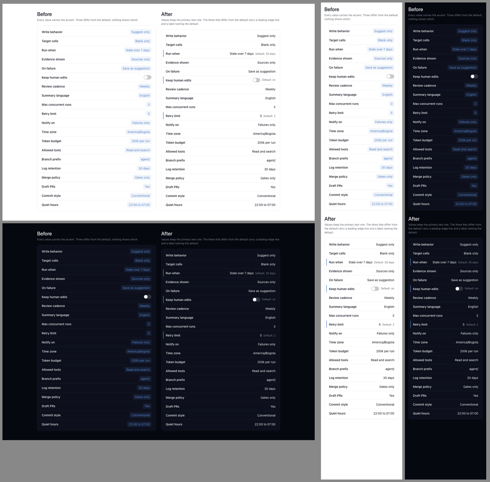

# Dogfood receipt

Date: 2026-08-09

## Plan

- **Stack:** Static web harnesses served over local HTTP. The skill repository has no deployable application stack.
- **Entry surfaces:** `/commerce/index.html` and `/reader/index.html`, independently materialized from the `foundation` profile.
- **Driver:** Interceptor in the user's real Chrome profile for navigation, state changes, accessibility-tree reads, and network inspection; Playwright for exact viewport screenshots and deterministic browser metrics.
- **Evidence:** The portability contact sheets and earlier agentic-extension evidence in [`dogfood/`](dogfood/).
- **Smoke:** Materialize and verify each target, require HTTP success for all explicit resources, and reject console errors, failed requests, horizontal overflow, unnamed buttons, or missing focus treatment.
- **End-to-end:** Change themes; filter merchandise and add an item to cart; change a reading collection, save a note, and exercise an empty search result.
- **Receipt anchor:** This file and the `broomva/skills` pull request.

## Portability test designs

### Commerce collection

A `foundation`-profile storefront for small-batch home objects. It uses a merchandising hero, product filters, prices, a cart action, product cards, and transaction feedback without any agentic-work vocabulary, work states, receipts, or orchestration shell.

### Editorial reader

A `foundation`-profile knowledge publication with collection navigation, search, sustained reading measure, article tools, a save action, and responsive mobile navigation. It uses the same visual identity through a structurally different content product.

## Portability receipt

| Plan row | Executed | Evidence |
|---|---|---|
| Materialization | Yes | Each finalized `foundation` target wrote and verified 8 files, including machine-readable semantic tokens. Neither target received work components, agentic motion, or the Maestro app. |
| Smoke | Yes | All 12 surface × viewport × theme cases loaded with no console errors, failed requests, or HTTP responses at 400 or above. |
| Visual themes | Yes | Twelve screenshots cover both non-agentic products at 375px, 768px, and 1440px in light and dark themes. |
| Responsive layout | Yes | Every case reported zero horizontal overflow. Commerce recomposed from a two-column hero and three-product grid; the reader moved its collection sidebar into mobile navigation. |
| Keyboard focus | Yes | The first keyboard-reachable control showed a solid `2px` focus outline in every case. No button lacked an accessible name. |
| Reduced motion | Yes | Harness transitions and animations computed to `0.01ms` under `prefers-reduced-motion: reduce`. |
| Commerce flow | Yes | In real Chrome, Interceptor changed to dark theme, selected the `Light` filter, reduced the accessible product set to one, added the Arc lamp, and observed `Cart · 1`. |
| Reader flow | Yes | In real Chrome, Interceptor changed to dark theme, saved the note (`pressed=true`), changed the active collection to `Materials and making`, searched for `missing`, and observed the empty-result status. |
| API or persistent side effect | Not applicable | These are static design harnesses; cart and saved-note state are intentionally session-local. |

## Visual conformity

- Both products preserve the blue-axis light/dark relationship, system application typography, scarce Resonant AI Blue, 4px rhythm, restrained radii, and matte working surfaces.
- The commerce surface expresses products, price, filters, cart state, and merchandising hierarchy rather than work orchestration.
- The reader expresses collections, article hierarchy, reading rhythm, search, and save state without becoming a card dashboard.
- Cal Sans appears only as an opt-in display face. Body, navigation, controls, metadata, and prices remain on the system or mono stacks assigned by role.
- Glass is limited to the transient commerce toast and sticky translucent chrome; ordinary cards, product surfaces, article content, and navigation remain matte.
- Functional and interactive state remains labeled structurally; no meaning relies on color alone.

## Agentic extension regression evidence

The earlier work-console and decision-receipt contact sheets remain as visual evidence for the optional agentic-work language:

The current automated suite separately verifies that `agentic-work` materializes the 31-export manifest, Composer, DotComet, Undertow, work components, motion, and extension reference while excluding Maestro and the full specimen/template payload.

Interceptor's native screenshot command timed out after the real-browser interactions. This does not inflate the visual claim: Interceptor supplied the real-Chrome DOM, accessible state changes, and interaction evidence; Playwright supplied the exact viewport pixels that were visually inspected and assembled into the contact sheets.

**Anti-rationalization check:** did the agent actually click the interfaces like a user would? Yes.

**Surfaces driven:** Interceptor in real Chrome, Playwright Chromium, local HTTP, and the materializer CLI.

**Time-to-receipt:** approximately 3 minutes from first test-harness write to captured portability evidence.

## Settings defaults specimen (BRO-2537)

Date: 2026-09-23. This is evidence for `DESIGN.md` §4 "Settings defaults": a 20-row settings list rendered with the shipped foundation tokens, before and after the rule. Three values differ from their defaults; one of them is a switch that is off by choice but on by default.

The cue used here is **one exploratory encoding, not the contract**: a `2px` Resonant AI Blue line on the row's leading edge, plus a `Default:` label. That line collides with the active-section indicator in the archived Maestro settings (`assets/system/apps/maestro/settings.css`). Choosing a non-colliding encoding, and adding a `Field` slot for the default label, is follow-up work.

**Files**

- Harness: [`dogfood/settings-change-marker.html`](dogfood/settings-change-marker.html).
- Measuring frame: [`dogfood/settings-change-marker-frame.html`](dogfood/settings-change-marker-frame.html).
- Driver: [`dogfood/settings-change-marker-measure.sh`](dogfood/settings-change-marker-measure.sh). Its output, which begins with the harness hash it measured, is [`dogfood/settings-change-marker-measure.out`](dogfood/settings-change-marker-measure.out).
- Setup: copy the harness and the frame into `<target>/settings/` of a `foundation`-profile target, and serve the target over local HTTP.
- Colors, type, spacing and radii come from foundation variables. Row height, switch geometry and chip padding are fixed values.

**What was measured**

- **Viewports:** 1440px, 768px and 375px, in light and dark themes. Headless Chrome has a 500px minimum window, so the frame renders the harness in an iframe of exactly the requested width.
- **Overflow:** `scrollWidth - clientWidth` is 0px at every width and theme. The positive control reads 1625px.
- **Overlap:** the number of value elements that intersect their row label's rendered text is 0 at every width and theme. The positive control reads 35. Overlap is measured against the label's text range, not its element box, because a squeezed label paints its text outside its box.
- **Contrast:** [`dogfood/settings-change-marker-contrast.py`](dogfood/settings-change-marker-contrast.py) applies WCAG 2.x to the OKLCH token values. Text pairs need 4.5:1; non-text pairs need 3:1.

**Contrast results**

| Pair | Light | Dark | Needs | Result |
|---|---:|---:|---:|---|
| Value: foreground on card | 18.98 | 17.16 | 4.5 | Pass |
| `Default:` label: muted-foreground on card | 6.00 | 5.21 | 4.5 | Pass |
| Leading line: Resonant AI Blue vs card | 3.98 | 4.78 | 3.0 | Pass |
| Default in a lighter role: Muted current on card | 6.00 | — | 4.5 | Pass |
| Default in a lighter role: Placeholder mist on card | 2.88 | — | 4.5 | **Fail** |
| Blue value text on card | 3.98 | 4.78 | 4.5 | **Fail** light, pass dark |
| Off switch track vs card | 1.63 | 1.49 | 3.0 | **Fail** |

**Reading the rows**

- A lighter text role is not always a contrast failure: Muted current passes. The rule forbids faded defaults because a faded value reads as disabled and an on-by-default switch drawn neutral reads as off. Placeholder mist would also fail contrast.
- Two rows predate this change and are tracked as foundation contrast gaps: light-theme links, which use the same blue on white at 3.98:1, and the off switch track.
