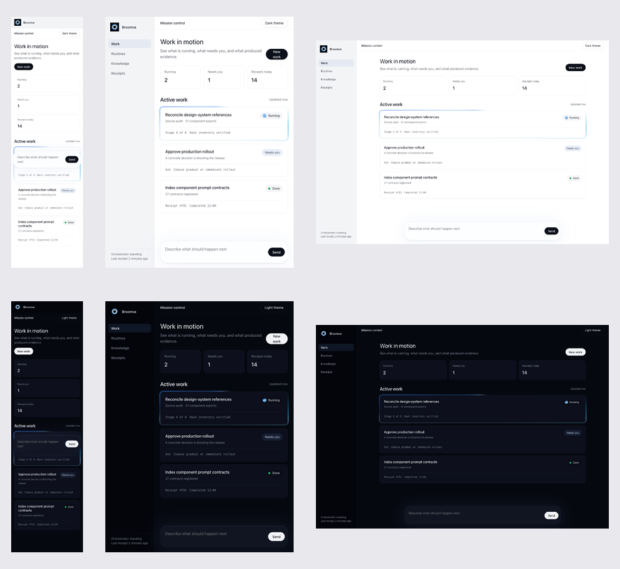
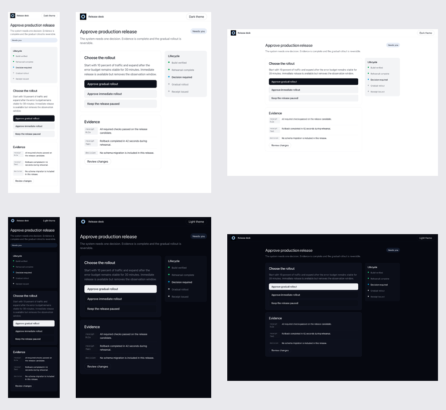
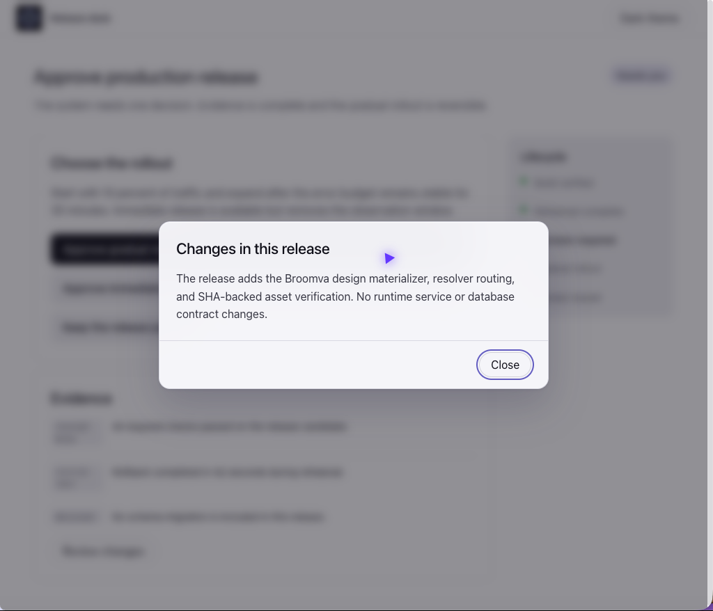

# Dogfood receipt

Date: 2026-08-09

## Plan

- **Stack:** Static web harness served over local HTTP. The repository itself has no deployable application stack.
- **Entry surfaces:** `/work-console/index.html` and `/decision-receipt/index.html`.
- **Driver:** Interceptor in the user's real Chrome profile for navigation, state changes, accessibility-tree reads, console and network probes; Playwright for exact viewport screenshots.
- **Evidence:** The contact sheets and dialog screenshot in [`dogfood/`](dogfood/).
- **Smoke:** Materialize each independent target, verify it, load it over HTTP, and require all referenced assets to return successfully.
- **End-to-end:** Switch both surfaces between light and dark themes; open and close the decision dialog; inspect focus, layout, state vocabulary, and reduced-motion behavior.
- **Receipt anchor:** This file and the `broomva/skills` pull request.

## Test designs

### Work console

A full-profile orchestration surface with quiet navigation, work summary, running Undertow, a `Needs you` ask, a completed receipt, and the signature floating composer.

### Decision receipt

A tokens-profile approval surface with one concrete human decision, lifecycle rail, machine-readable receipts, matte cards, and earned glass only in its review dialog.

## Receipt

| Plan row | Executed | Evidence |
|---|---|---|
| Materialization | Yes | Full profile wrote and verified 179 files. Tokens profile wrote and verified 14 files. |
| Smoke | Yes | Both pages returned HTTP 200 with zero failed resource responses and no console errors. |
| Visual themes | Yes | Twelve screenshots cover both surfaces at 375px, 768px, and 1440px in light and dark themes. |
| Responsive layout | Yes | Every case reported zero horizontal overflow. Content order remained legible at mobile, tablet, and desktop widths. |
| Keyboard focus | Yes | First keyboard-reachable control showed a solid 2px focus outline in every case. |
| Reduced motion | Yes | Undertow and tidepool computed `animation-name: none` under `prefers-reduced-motion: reduce`. |
| Interaction | Yes | Interceptor switched themes in both pages, opened the review dialog, verified its accessible close control, and closed it. |
| API contract | Not applicable | These are static design harnesses with no backend or persistent side effect. |

## Visual conformity

- Blue-axis light and dark foundations remain coupled through semantic tokens.
- Application typography stays on the system sans stack.
- Cards, navigation, and lifecycle surfaces stay matte.
- Glass appears only on the composer and modal dialog.
- Card, dialog, control, and composer radii follow their assigned roles.
- `Running`, `Needs you`, and `Done` always pair color with text or structure.
- Receipts, asks, and lifecycle stages replace synthetic completion percentages.
- Accent blue remains limited to focus, selection, live work, and the current lifecycle stage.

Interceptor's native screenshot command timed out in this environment. This did not block browser interaction or inspection: Interceptor supplied the real-browser DOM, accessibility, theme-change, dialog, console, and network evidence; macOS screen capture supplied the real-Chrome dialog image; Playwright supplied deterministic viewport pixels.

**Anti-rationalization check:** did the agent actually click the interfaces like a user would? Yes.

**Surfaces driven:** Interceptor, real Chrome, macOS screen capture, Playwright, and the materializer CLI.
